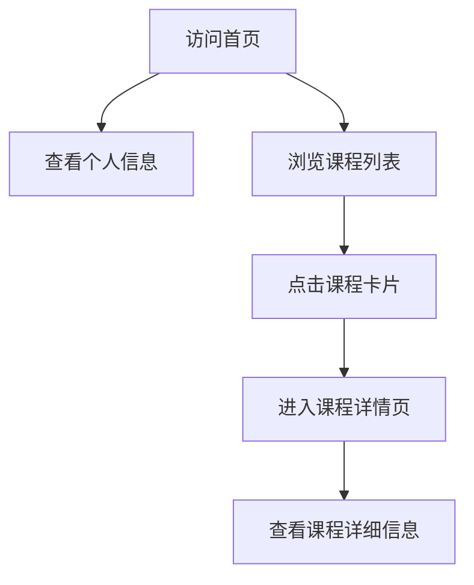

## 1. Product Overview
个人学习页面，展示广东科学技术职业学院商学院商务数据分析与应用专业学生张茵茵的课程信息
- 主要目的是展示个人课程信息，方便后续补充课程内容
- 目标用户是张茵茵同学本人、同学、老师等相关人员

## 2. Core Features

### 2.1 User Roles (if applicable)
| Role | Registration Method | Core Permissions |
|------|---------------------|------------------|
| 访问者 | 无需注册 | 浏览所有课程信息 |

### 2.2 Feature Module
1. **首页**: 个人信息展示、课程列表、导航栏
2. **课程详情页**: 课程详细信息、课程内容展示

### 2.3 Page Details
| Page Name | Module Name | Feature description |
|-----------|-------------|---------------------|
| 首页 | 个人信息展示 | 展示张茵茵的个人基本信息，包括姓名、学校、专业等 |
| 首页 | 课程列表 | 展示所有课程的卡片列表，包含课程名称、简短描述等 |
| 首页 | 导航栏 | 提供页面导航功能，方便访问不同部分 |
| 课程详情页 | 课程详细信息 | 展示课程的详细介绍、学习内容等 |
| 课程详情页 | 课程内容展示 | 展示课程的具体内容，后续可补充 |

## 3. Core Process
用户访问首页，查看个人信息和课程列表，点击课程卡片进入课程详情页查看详细信息

## 4. User Interface Design
### 4.1 Design Style
- 主色调：蓝色 (#3B82F6) 和白色 (#FFFFFF)
- 辅助色：浅灰 (#F3F4F6) 和深灰 (#374151)
- 按钮风格：圆角按钮，悬停效果
- 字体：无衬线字体，标题使用较大字号
- 布局风格：卡片式布局，响应式设计
- 图标风格：简约现代风格图标

### 4.2 Page Design Overview
| Page Name | Module Name | UI Elements |
|-----------|-------------|-------------|
| 首页 | 个人信息展示 | 居中布局，包含头像、姓名、学校、专业信息，使用卡片式设计，阴影效果 |
| 首页 | 课程列表 | 网格布局，每个课程为一个卡片，包含课程名称、简短描述，悬停时有轻微缩放效果 |
| 首页 | 导航栏 | 顶部固定导航栏，包含页面标题和导航链接 |
| 课程详情页 | 课程详细信息 | 顶部课程标题，下方课程介绍，使用卡片式布局 |
| 课程详情页 | 课程内容展示 | 结构化展示课程内容，支持后续补充 |

### 4.3 Responsiveness
- 桌面优先设计，同时支持移动端自适应
- 移动端优化：卡片布局调整为单列，导航栏简化
- 触摸优化：按钮和卡片尺寸适合触摸操作

### 4.4 3D Scene Guidance (if applicable)
- 不适用