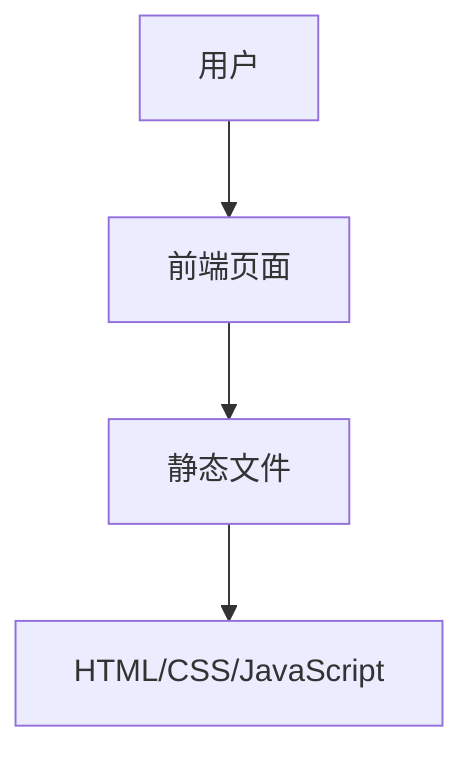

## 1. Architecture Design

## 2. Technology Description
- Frontend: 纯静态HTML + CSS + JavaScript
- Initialization Tool: 无
- Backend: 无
- Database: 无

## 3. Route Definitions
| Route | Purpose |
|-------|---------|
| /index.html | 首页，展示个人信息和课程列表 |
| /courses/ | 课程详情页目录 |
| /courses/python.html | Python基础课程详情页 |
| /courses/data-analysis.html | 数据分析技术课程详情页 |
| /courses/data-collection.html | 数据采集与处理课程详情页 |
| /courses/supply-chain.html | 供应链数据分析课程详情页 |
| /courses/database.html | 数据库原理与应用课程详情页 |

## 4. API Definitions (if backend exists)
- 不适用

## 5. Server Architecture Diagram (if backend exists)
- 不适用

## 6. Data Model (if applicable)
- 不适用